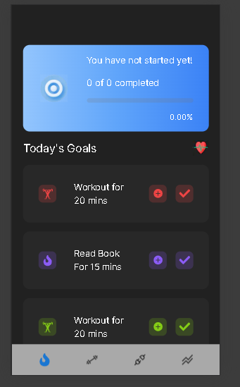

# Goal Tracker App



## Getting Started

First, run the development server:

```bash
npm run dev
# or
yarn dev
# or
pnpm dev
# or
bun dev
```

Open [http://localhost:3000](http://localhost:3000) with your browser to see the result.

You can start editing the page by modifying `app/page.tsx`. The page auto-updates as you edit the file.

## Features

- User can track and untrack each goal.
- User can track all goals by swiping to the right.
- Progress bar updates whenever a goal is checked by the user.
- Progress bar division is calculated as 100% / Total number of goals.
- Graph based on progress percentage with Percentage (y-axis) and Date (x-axis).
- Bottom navigation menu for navigating between pages.
- Pages 2, 3, and 4 are blank with their names.

## Goal Properties

Each goal has the following properties:

- Name
- isTracked
- isComplete
- DateCompleted

## Implementation Details

### Technologies Used

- React
- TypeScript
- Next.js

### Goal Context

The goal context manages the state of the goals and provides a dispatch function to update the state.

### Hooks for Progress

Hooks to get daily progress and progress for today.

## Usage

You can utilize the provided GoalContext and hooks to manage and track goals in your application.
